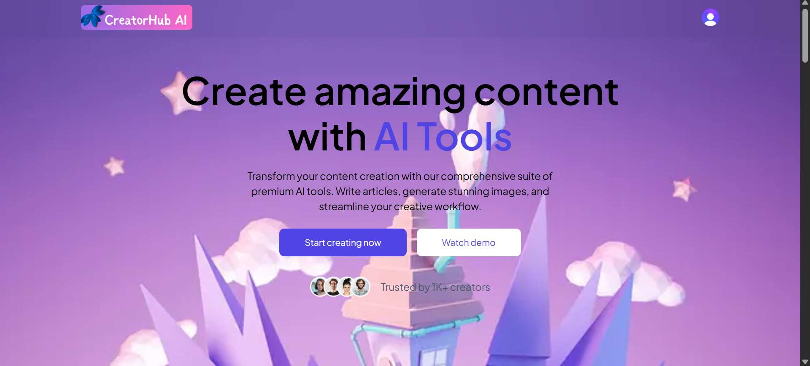
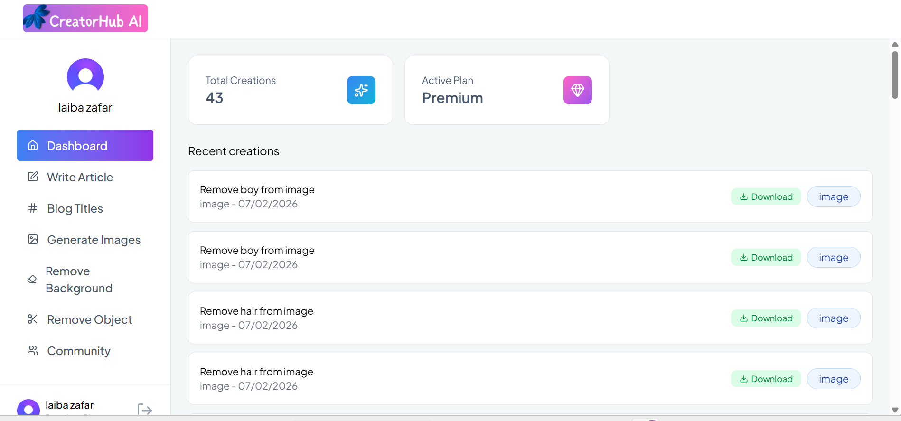

# CreatorHub AI


CreatorHub AI is a full-stack web application that leverages AI tools to generate content, images, and assist users in various creative workflows. This project demonstrates modern web development with React, Node.js, and AI integrations.

---

## Features

- Text-to-Image generation using AI
- Blog title & article generation
- Background & object removal in images
- User authentication and plan management
- Interactive dashboard for user creations
- Community sharing of AI-generated content

---

## Tech Stack

- **Frontend:** React, Tailwind CSS, Vite  
- **Backend:** Node.js, Express  
- **Database:** MySQL / MongoDB (whichever you used)  
- **AI Tools:** Google Gemini / OpenAI APIs  
- **Image Hosting:** Cloudinary  

---

## Screenshots

### Homepage


### Dashboard


---


## Installation

1. Clone the repo:

```bash
```
git clone https://github.com/Laiba-Zafar7/creatorhub-ai.git
cd creatorhub-ai

###Install dependencies:
# For backend
cd server
npm install

# For frontend
cd ../client
npm install

###Run the project:
# Backend
cd server
npm run dev

# Frontend
cd ../client
npm run dev
##Open your browser at http://localhost:5173 (default Vite port)

Contributing

Fork the project

Create a branch: git checkout -b feature-name

Commit your changes: git commit -m "Add feature"

Push to the branch: git push origin feature-name

Open a Pull Request

License

This project is licensed under the MIT License.

