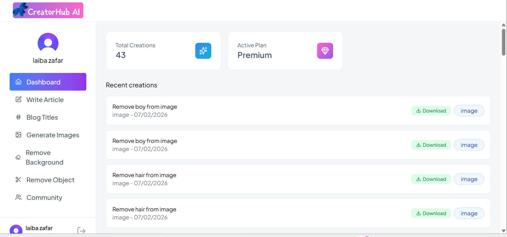

<div align="center">

<h1>🎨 CreatorHub AI</h1>

<p>A full-stack AI-powered creative platform for generating content, images, and streamlining creative workflows.</p>

[](https://reactjs.org/)
[](https://nodejs.org/)
[](https://tailwindcss.com/)
[](https://vitejs.dev/)
[](https://opensource.org/licenses/MIT)

[Features](#-features) · [Tech Stack](#-tech-stack) · [Screenshots](#-screenshots) · [Getting Started](#-getting-started) · [Contributing](#-contributing)

</div>

---

## 📖 Overview

**CreatorHub AI** is a modern web application that brings the power of artificial intelligence to your creative workflow. Whether you're generating stunning images from text prompts, crafting compelling blog content, or editing photos with AI-powered tools — CreatorHub AI has you covered.

---

## ✨ Features

| Feature | Description |
|---|---|
| 🖼️ **Text-to-Image Generation** | Transform text prompts into stunning AI-generated visuals |
| ✍️ **Blog Content Generation** | Auto-generate blog titles and full articles using AI |
| 🧹 **Background Removal** | Remove or replace image backgrounds in seconds |
| ✂️ **Object Removal** | Cleanly erase unwanted objects from any image |
| 🔐 **User Authentication** | Secure login, registration, and plan management |
| 📊 **Interactive Dashboard** | Manage and review all your AI-generated creations |
| 🌐 **Community Sharing** | Share your AI creations with the CreatorHub community |

---

## 🛠 Tech Stack

### Frontend
- **React** — UI framework
- **Tailwind CSS** — Utility-first styling
- **Vite** — Fast development build tool

### Backend
- **Node.js** — Runtime environment
- **Express** — Web framework for RESTful APIs

### Database
- **MySQL / MongoDB** — Persistent data storage

### AI & Media
- **Google Gemini / OpenAI APIs** — Powering content and image generation
- **Cloudinary** — Image hosting and transformation

---

## 📸 Screenshots

### Homepage 
 
### Dashboard 


---

## 🚀 Getting Started

### Prerequisites

Make sure you have the following installed:
- [Node.js](https://nodejs.org/) (v18 or higher)
- [npm](https://www.npmjs.com/) (v9 or higher)
- A running instance of MySQL or MongoDB

### Installation

**1. Clone the repository**

```bash
git clone https://github.com/Laiba-Zafar7/creatorhub-ai.git
cd creatorhub-ai
```

**2. Configure environment variables**

Create `.env` files in both `server/` and `client/` directories. Use the provided `.env.example` files as a reference:

```bash
# server/.env
cp server/.env.example server/.env

# client/.env
cp client/.env.example client/.env
```

Fill in your API keys (Gemini/OpenAI, Cloudinary, DB credentials, etc.)

**3. Install dependencies**

```bash
# Install backend dependencies
cd server
npm install

# Install frontend dependencies
cd ../client
npm install
```

**4. Run the development servers**

```bash
# Start the backend (from /server)
npm run dev

# Start the frontend (from /client)
npm run dev
```

The app will be running at **[http://localhost:5173](http://localhost:5173)**

---

## 📁 Project Structure

```
creatorhub-ai/
├── client/               # React frontend (Vite)
│   ├── src/
│   │   ├── components/   # Reusable UI components
│   │   ├── pages/        # Route-level page components
│   │   ├── hooks/        # Custom React hooks
│   │   └── utils/        # Helper functions
│   └── public/
├── server/               # Node.js / Express backend
│   ├── controllers/      # Route handlers
│   ├── routes/           # API route definitions
│   ├── models/           # Database models
│   └── middleware/       # Auth & validation middleware
└── README.md
```

---

## 🤝 Contributing

Contributions are welcome! Here's how to get started:

1. **Fork** the repository
2. **Create** your feature branch:
   ```bash
   git checkout -b feature/your-feature-name
   ```
3. **Commit** your changes:
   ```bash
   git commit -m "feat: add your feature description"
   ```
4. **Push** to the branch:
   ```bash
   git push origin feature/your-feature-name
   ```
5. **Open a Pull Request** and describe your changes

Please make sure your code follows the existing style and that all tests pass before submitting a PR.

---

## 📄 License

This project is licensed under the **MIT License** — see the [LICENSE](LICENSE) file for details.

---

<div align="center">
  <p>Built with ❤️ by <a href="https://github.com/Laiba-Zafar7">Laiba Zafar</a></p>
</div>
